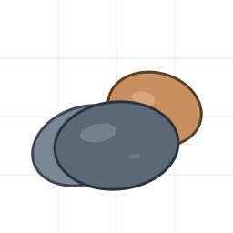
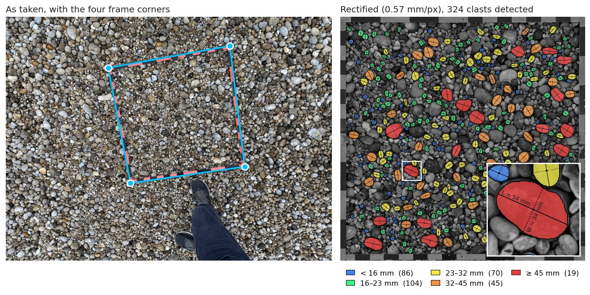
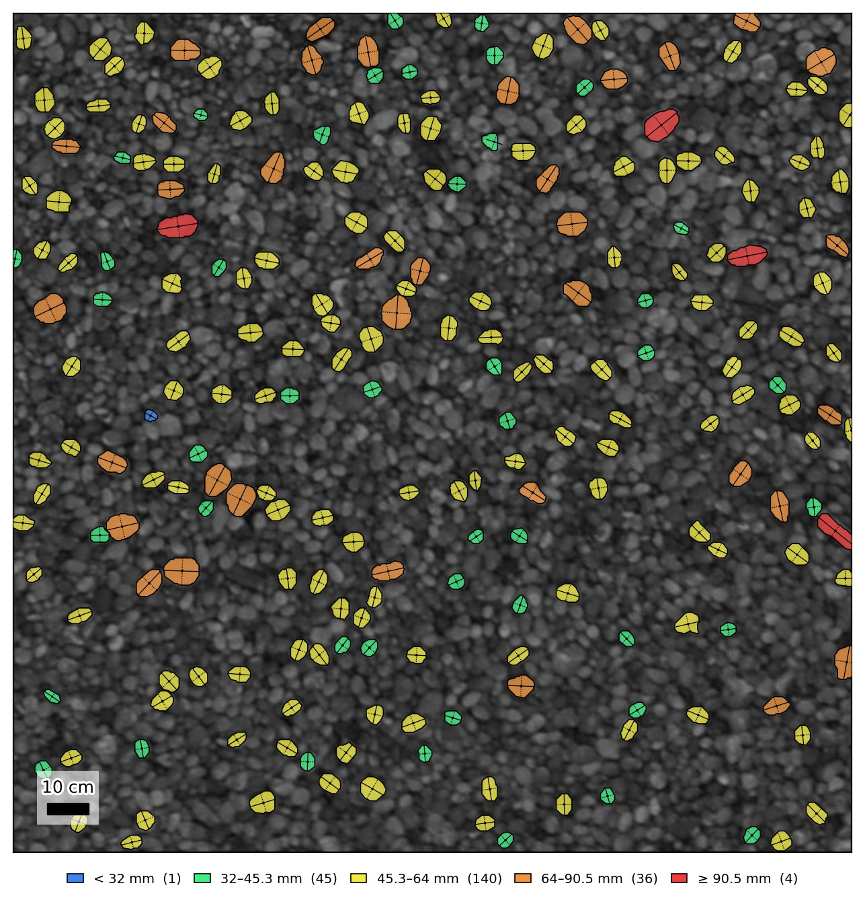
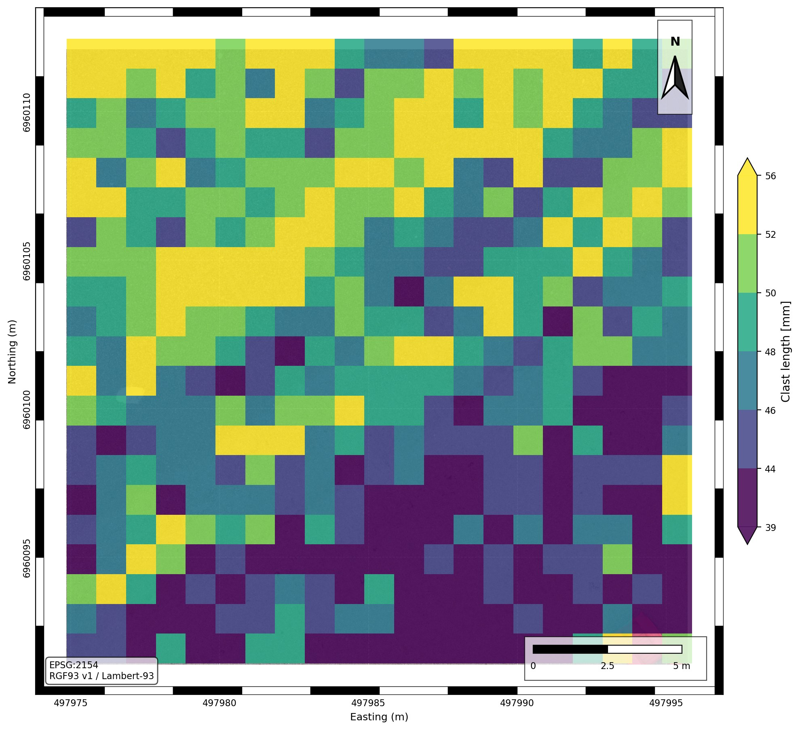
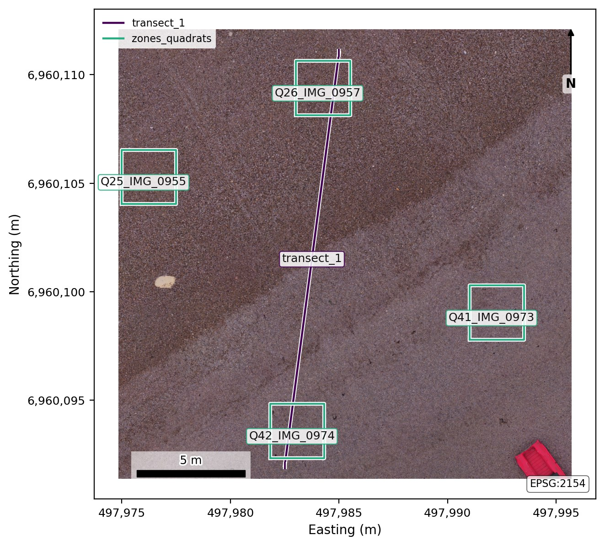
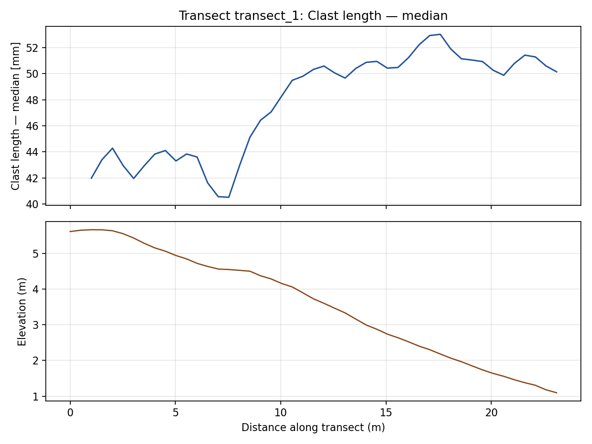
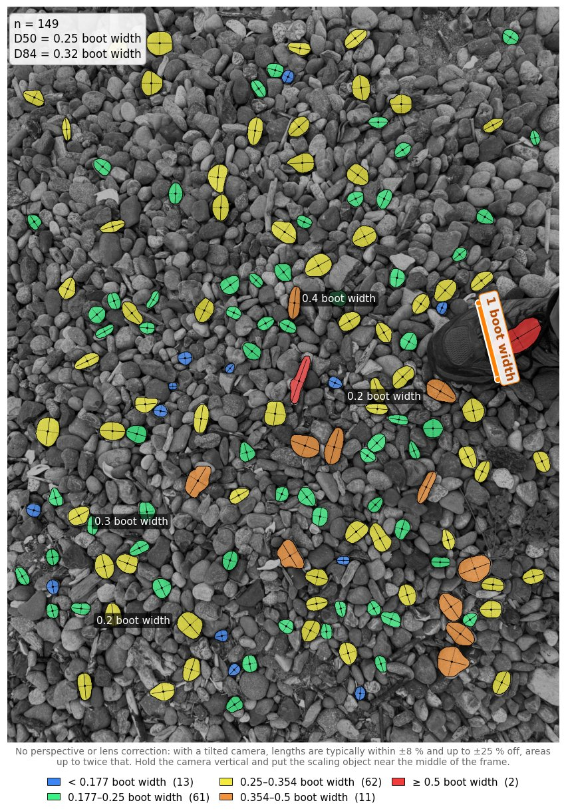
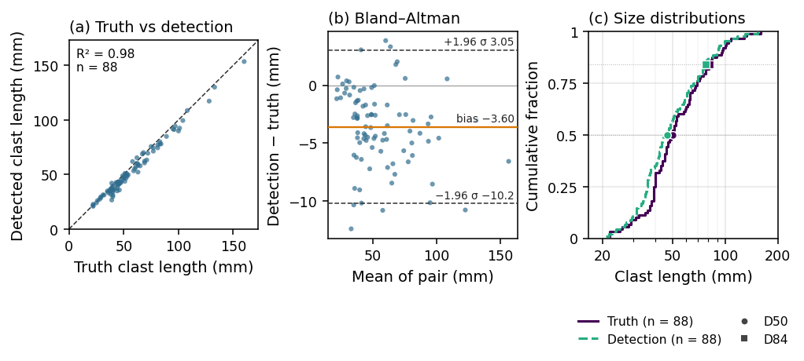
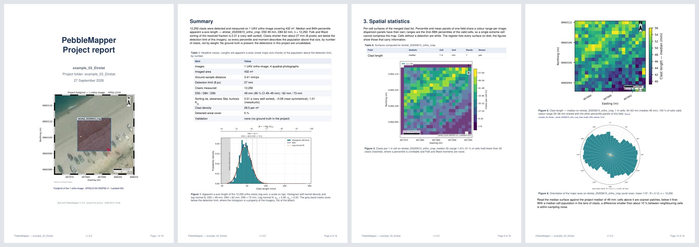
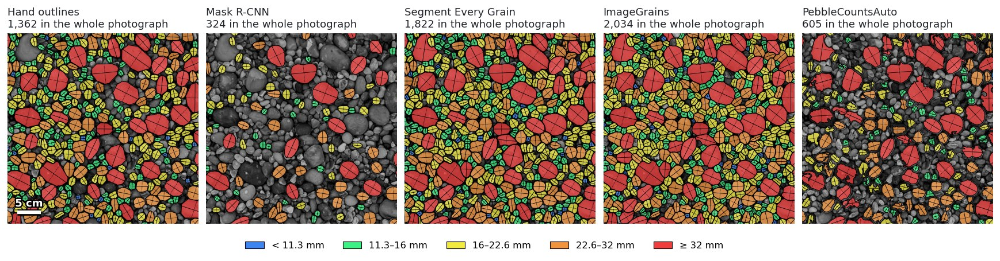

<p align="center">
  
</p>

<h1 align="center">PebbleMapper</h1>

<p align="center">
  Detection, measurement and mapping of individual rounded clasts in photographs and drone ortho-images.
</p>

<p align="center">
  <a href="https://github.com/soloyant/pebblemapper/actions/workflows/tests.yml"></a>
  <a href="LICENSE"></a>
  
  
</p>

PebbleMapper detects individual rounded clasts (pebbles, cobbles) in images of known
scale, measures each one, and turns the measurements into grain-size distributions, maps,
zonal statistics and a PDF report. It works clast by clast, so every statistic can be traced
back to the outlines it was computed from. Detection uses the Mask R-CNN model of
[Soloy et al. (2020)](https://doi.org/10.3390/rs12213659); other detection models can be
added as plug-ins. It is a desktop application with a browser interface and runs entirely
on your computer.

<p align="center">
  
</p>
<p align="center"><em>A quadrat photograph from the Étretat example as taken (left) and after
rectification and detection (right): each clast coloured by its half-phi size class, with its
length (solid) and width (dotted) chords. The inset shows the two measured chords of one clast.</em></p>

## Scope

The examples below come from the projects shipped in `datasets/` and can be reproduced from
them.

**Ortho-images of any size.** A georeferenced ortho-image is processed tile by tile at one or
several window sizes; detections in overlapping tiles are merged, and each clast is written
once, in the image's coordinate system, with its length and width (apparent a- and b-axes),
area, perimeter, orientation, shape indices and detection score. On the Étretat example
(21 × 21 m at 3.4 mm/px) this gives 12,292 clasts.

<p align="center">
  
</p>
<p align="center"><em>A 2 m window of the Étretat ortho-image: each detected clast by size
class, with its length and width chords.</em></p>

**Grain-size maps.** Any per-clast quantity (length, width, area, a custom formula) is
aggregated on a regular grid: percentiles, mean, Folk and Ward sorting, skewness, kurtosis,
density. Rasters are GeoTIFFs; the Map tab composes them into figures with scale bar, grid,
north arrow and basemap.

<p align="center">
  
</p>
<p align="center"><em>D50 of clast length per 1 m cell over the Étretat ortho-image.</em></p>

**Zonal statistics and transects.** Statistics are extracted per polygon (quadrats, habitat
zones, survey units) and along transects, from GeoJSON drawn in the app or imported.

<p align="center">
  
  
</p>
<p align="center"><em>Left: the four quadrats of the Étretat example, placed in the ortho-image
from their photographs, and a cross-shore transect. Right: D50 and elevation along the
transect, from the landward end: the median clast length rises from about 43 to 50 mm
across the break in slope.</em></p>

**Scale from an object.** A photograph taken without a quadrat or a known ground sample
distance is scaled from an object in the picture. With the object's size unknown, clasts are
measured in multiples of it; with its size known, in millimetres.

<p align="center">
  
</p>
<p align="center"><em>149 clasts measured in boot widths on a phone photograph (example_04;
photograph by Dr Mark Lorang).</em></p>

**Validation.** Detections are compared with clasts outlined by hand in the Digitize tab or
measured with a caliper: paired clast by clast, then as distributions (Bland–Altman
agreement, cumulative curves, Kolmogorov–Smirnov test, truncation at the detection limit).

<p align="center">
  
</p>
<p align="center"><em>The built-in model against the caliper on the 105 pebbles of
Soloy et al. (2020) (example_06): 88 pairs, R² 0.98, bias −3.6 mm.</em></p>

**Reports.** One PDF per project states the inputs, the method, the statistics per image,
the maps, the validation and their limits, with a data dictionary and references.

<p align="center">
  
</p>
<p align="center"><em>Pages of the report generated for the Étretat example.</em></p>

## Installation

PebbleMapper runs on Windows 10 and 11 (64-bit). You need about 10 GB of free disk space
and an internet connection during the installation. An NVIDIA graphics card makes
detection faster but is not required.

1. On this page, click the green **Code** button, then **Download ZIP**.
2. Create a folder with a short path that is not synchronised by OneDrive or Dropbox, for
   example `C:\PebbleMapper`. In your Downloads folder, right-click `pebblemapper-main.zip`,
   choose **Extract All…**, select that folder and click **Extract**. PebbleMapper runs from
   it, so keep it.
3. In the extracted folder, open `pebblemapper-main` until you see the file
   **Install PebbleMapper**, and double-click it. If Windows asks for confirmation, click
   **Run**, or **More info** then **Run anyway**.
4. A black window shows the progress. The installation takes 20 to 60 minutes. It
   installs Python (through Miniforge) if your computer has none, downloads the model (once it is public, see below),
   and ends with *PebbleMapper is installed*. Press a key to close the window.
5. Double-click the **PebbleMapper** icon on your desktop. The application opens in your
   web browser. Keep the black window open while you work; closing it stops PebbleMapper.

> **Model weights.** The trained Mask R-CNN weights are not public yet: their licensing is
> being cleared, which should be settled in the coming weeks. The installation completes
> without them and every tab except Detect works. In the meantime the author sends the
> weights privately on request: [open an issue](https://github.com/soloyant/pebblemapper/issues).
> Place the file you receive at `model_weights/mask_rcnn_clasts.h5` in the PebbleMapper
> folder.

If the installation stops with an error, double-click **Install PebbleMapper** again. It
continues where it stopped. To uninstall, delete the `pebblemapper-main` folder, the
`miniforge3` folder in your user folder (only if the installer created it) and the desktop
icon.

<details>
<summary>Installation from the command line (developers, Linux, macOS)</summary>

```bash
git clone https://github.com/soloyant/pebblemapper
cd pebblemapper
conda env create -f environment.yml    # on a machine without an NVIDIA GPU, remove the cudatoolkit and cudnn lines first
conda activate maskrcnn
python -m detectors.download_weights   # 367 MB, from Zenodo
python tools/check_install.py
python -m gui.app
```

On Windows, `.\install.ps1` does the same (`-Cpu`, `-SkipWeights`, `-Force`, `-CondaRoot <folder>`,
`-NoShortcut`). Linux and macOS are not tested; `gui/launch_gui.sh` starts the application
there.

</details>

## Getting started

The application opens on the **Overview** tab. Choose the folder that holds your projects,
then pick one of the example projects below or create your own. The tabs follow the order
of the work: Orthorectify, Detect, Digitize and Validate for photographs; Detect, Merge,
Rasterize, Map and Zonal for drone ortho-images; Report for both. **Express** runs the
whole drone-ortho chain in one step.

Example projects, in the `datasets` folder:

| Project | Content |
|---|---|
| `example_01_orthorectification` | A handheld quadrat photograph to rectify. |
| `example_02_quadrat_detection` | Rectified quadrat photographs to detect and digitise. |
| `example_03_Etretat` | A survey of the shingle beach at Étretat (Normandy, 10 June 2020): a 21 × 21 m crop of the drone ortho-image and its elevation model, four quadrat photographs, one of them with 1,362 clasts outlined by hand, RTK positions, zones and a transect. Every tab can be tried on it. |
| `example_04_gauge_scale` | A phone photograph with a boot for scale, for sizing clasts without a quadrat frame. |
| `example_06_paper_validation` | The caliper validation set of Soloy et al. (2020): 105 pebbles measured with a caliper, photographed spread out and, for the 27 largest, in ten arrangements up to heaped. A truth file per photograph. |

The [user manual](docs/user-manual.md) describes every tab, and the installation step by step
(section 2.1).

## Accuracy and limits

On IMG_0806 of `example_06_paper_validation` (105 pebbles spread out on tarmac,
0.50 mm/px), the built-in model finds 88 pebbles and makes no false detection. Detected
length against the caliper a-axis: R² 0.98, RMSE 4.9 mm, bias −3.6 mm. The 17 pebbles it
misses are the smallest: none of the five under 20 mm is found.

The model was trained only on pebbles lying fully visible on top of the sediment, with
no overlap or burial, and is tuned for precision over recall. On IMG_0955 of
`example_03_Etretat` (0.57 mm/px), 1,362 pebbles were outlined by hand under the same
rule. The model finds 320 of them (recall 0.23, precision 0.99), with a length RMSE of
1.6 mm; D50 20.2 mm against 17.7 mm by hand, D84 34.2 mm against 26.5 mm. Clasts shorter
than 8 pixels are below the detection limit.

## Other detection models

Four plug-ins let PebbleMapper run five other published models (the ImageGrains plug-in
provides ImageGrains 2.0 and 1.2). Each is a separate repository
with its own environment, licence and installation guide:
[Segmenteverygrain](https://github.com/soloyant/pebblemapper-backend-segmenteverygrain),
[ImageGrains](https://github.com/soloyant/pebblemapper-backend-imagegrains),
[OrthoSAM](https://github.com/soloyant/pebblemapper-backend-orthosam) and
[PebbleCountsAuto](https://github.com/soloyant/pebblemapper-backend-pebblecounts). PebbleMapper measures the
outlines every model returns with the same measurement step.

The same photograph (IMG_0955, 1,362 fully visible pebbles outlined by hand) through each model:

| Model | Detections | True positives | Recall | Precision | F1 | Length RMSE | D50 | D84 | Time per photograph |
|---|---|---|---|---|---|---|---|---|---|
| Hand outlines (reference) | 1,362 | | | | | | 17.7 mm | 26.5 mm | |
| Mask R-CNN (built in) | 324 | 320 | 0.23 | 0.99 | 0.38 | 1.6 mm | 20.2 mm | 34.2 mm | 41 s (GPU) |
| [Segmenteverygrain](https://github.com/zsylvester/segmenteverygrain) | 1,822 | 1,350 | 0.99 | 0.74 | 0.85 | 1.0 mm | 17.7 mm | 26.3 mm | 259 s (GPU) |
| [ImageGrains](https://github.com/dmair1989/imagegrains) 2.0 | 2,928 | 1,346 | 0.99 | 0.46 | 0.63 | 1.4 mm | 14.5 mm | 22.1 mm | 154 s (GPU) |
| [ImageGrains](https://github.com/dmair1989/imagegrains) 1.2 | 2,034 | 1,316 | 0.97 | 0.65 | 0.78 | 1.7 mm | 17.2 mm | 26.0 mm | 51 s (CPU) |
| [PebbleCountsAuto](https://github.com/UP-RS-ESP/PebbleCounts) | 605 | 491 | 0.36 | 0.81 | 0.50 | 4.1 mm | 21.0 mm | 35.3 mm | 17 s (CPU) |
| [OrthoSAM](https://github.com/UP-RS-ESP/OrthoSAM) | 1,659 | 1,079 | 0.79 | 0.65 | 0.71 | 1.4 mm | 17.6 mm | 26.8 mm | 430 s (GPU) |

Detections are paired with the 1,362 hand-outlined clasts by position and size, as
PebbleMapper's Validate tab does. A true positive is a detection paired with a
hand-outlined clast; recall is true positives over the 1,362 hand-outlined clasts,
precision is true positives over the detections, and F1 is their harmonic mean. False
negatives (1,362 minus true positives) and false positives (detections minus true
positives) follow from the table. Length RMSE is computed on the true positives.

The hand outlines keep only the pebbles lying fully visible on top of the sediment;
partly buried and overlapping pebbles were removed by hand. This is the rule Mask R-CNN's
training labels follow. The hand outlines were started from Segmenteverygrain's
detections. Times are for one photograph once the model is loaded (loading adds 7 to
70 s once per run), on a 2018 laptop (Intel Core i7-8850H, NVIDIA Quadro P600 with 4 GB).
ImageGrains 1.2 and PebbleCountsAuto run on the CPU.

Settings used for every run in the table:

| Model | Code and model file | Settings |
|---|---|---|
| Mask R-CNN | PebbleMapper 1.0.0, `mask_rcnn_clasts.h5` | minimum confidence 0.7; the whole photograph is resized to 1,024 × 1,024 px inside the network |
| Segmenteverygrain | segmenteverygrain 0.5.0; U-Net `seg_model_smooth_labels.keras`; SAM 2.1 `sam2.1_hiera_large.pt` | patch 2,000 px, overlap 600 px; `min_area` 100 px, `min_grain_area` 50 px, `dbs_max_dist` 20, `dilation` 3; edge grains kept |
| ImageGrains 2.0 | imagegrains 2.0.2, Cellpose 4.2.1; `IG2_full_set_cp_SAM` | Cellpose `min_size` 15 px, diameter estimated by Cellpose; long side capped at 2,048 px; none of ImageGrains' own filters (`min_diameter`, `pix_cutoff`, `edge_filter`) |
| ImageGrains 1.2 | imagegrains 1.2.1, Cellpose 2.3.2; `IG2_full_set.200525`, a Cellpose 2 model trained on the IG2 dataset (not an IG1 model) | as for 2.0, with `channels` [0, 0] |
| PebbleCountsAuto | PebbleCounts 4c80b2f (2023), `PebbleCountsAuto.py` | `otsu_threshold` 50, `cutoff` 20, `percent_overlap` 15, `misfit_threshold` 30, `min_size_threshold` 10, `first_nl_denoise` 5, `tophat_th` 90, `sobel_th` 90, `canny_sig` 2 |
| OrthoSAM | OrthoSAM 18da0e5; SAM v1 `sam_vit_b_01ec64.pth` | tile 1,024 px, overlap 200 px, 30 × 30 prompts per tile, stability 0.85, dilation 5, smallest grain 30 px; a second pass at half resolution |

For every model, the frame band is left out and every returned outline is measured by
PebbleMapper's own step, so the sizes in the table are areal (by number of clasts), not grid
samples.

<p align="center">
  
</p>
<p align="center"><em>A 40 cm crop of the same photograph: the hand outlines and each model's
detections, both ImageGrains versions included, on the same size classes in every panel.</em></p>

## Documentation

- [User manual](docs/user-manual.md): every tab, the clast table, the project folders and
  custom equations.
- For developers: the [Python API](docs/developer/api.md) and
  [adding a detection model](docs/developer/adding-a-detection-model.md).

Questions, bug reports and suggestions: [open an issue](https://github.com/soloyant/pebblemapper/issues).
The **Feedback** section of the application's side menu builds a diagnostic file to
attach; it contains versions and logs, no images or measurements.

## Citation

Please cite the method paper when publishing results obtained with PebbleMapper:

> Soloy, A.; Turki, I.; Fournier, M.; Costa, S.; Peuziat, B.; Lecoq, N. (2020). *A Deep
> Learning-Based Method for Quantifying and Mapping the Grain Size on Pebble Beaches.*
> Remote Sensing, 12(21), 3659. [doi:10.3390/rs12213659](https://doi.org/10.3390/rs12213659)

and the trained model: Soloy, A.; Turki, I.; Fournier, M.; Costa, S.; Peuziat, B.; Lecoq, N.
(2026). *PebbleMapper: trained Mask R-CNN weights for clast detection.* Zenodo. [doi:10.5281/zenodo.20779877](https://doi.org/10.5281/zenodo.20779877) (publication pending)

`CITATION.cff` gives both in machine-readable form (GitHub's *Cite this repository*).

## Licence

The code is released under the MIT licence ([`LICENSE`](LICENSE)). `mrcnn/` contains the
[Matterport implementation of Mask R-CNN](https://github.com/matterport/Mask_RCNN) (MIT,
[`mrcnn/LICENSE`](mrcnn/LICENSE)). The trained weights and the example data are released
under Creative Commons Attribution 4.0 (CC BY 4.0), except the photograph of
`example_04_gauge_scale`, which remains Dr Mark Lorang's (see its `README.txt`). Maps drawn over a basemap must credit
the tile provider (Esri World Imagery, OpenStreetMap).

## Acknowledgements

The method and the trained model were developed during Antoine Soloy's doctoral research,
funded by the Région Normandie. Dr Mark Lorang provided the photograph of
`example_04_gauge_scale` used to develop and illustrate scaling from an object. PebbleMapper replaces the earlier
[Clast Size Mapping](https://github.com/soloyant/clast-size-mapping) code of Soloy et al.
(2020). It was developed by Antoine Soloy with Claude (Anthropic) as a programming
assistant for much of the code, tests and documentation; the method, the decisions and the
validation are the author's.
