# PebbleMapper user manual

PebbleMapper detects clasts (pebbles, cobbles) in photographs and drone ortho-images,
measures each one, and turns the measurements into grain-size rasters, maps, zonal
statistics, validation results and a PDF report. It runs locally in a web browser; no data
leaves the computer.

Controls are named as they appear on screen, in **bold**. File and folder names are in
`monospace`. Three reference sections close the manual: [The clast table](#the-clast-table), [Project folders](#project-folders) and [Custom equations](#custom-equations).

---

## 1. Overview

PebbleMapper works on two kinds of imagery:

| Mode | Input | Processing |
|---|---|---|
| **Ortho** | A georeferenced ortho-image (GeoTIFF) from a drone survey | Cut into square tiles of a set size in metres; each tile is detected and the results are stitched into one table in the ortho's coordinate system. |
| **Quadrat** | A photograph of known ground sample distance (GSD, metres per pixel), usually a rectified photograph of a quadrat frame | Processed whole; sizes are pixels × GSD. |

The built-in detection model is Mask R-CNN (Soloy et al., 2020), which outlines each visible
clast. Other models can be installed as plug-ins. From each outline PebbleMapper measures
length and width, best-fit ellipse axes, area, perimeter, equivalent diameter, eccentricity,
solidity, mean intensity, detection score and orientation.

A project produces clast CSVs (one row per clast; see [The clast table](#the-clast-table)),
GeoTIFF rasters of per-cell statistics, map figures, zonal statistics per polygon or along
transects, validation against hand-digitised ground truth, and a PDF report.

The **Express** tab runs the Ortho pipeline (detect, merge, rasterize, map, report) on one
ortho. The other tabs give full control and add the Quadrat workflow (Orthorectify, Detect,
Digitize, Validate) and quadrat placement in an ortho (Georeference).

---

## 2. Getting started

### 2.1 Installing and launching

PebbleMapper is written in Python and runs in a *conda environment*: a self-contained folder
holding Python and every library the application uses, kept apart from anything else
installed on the computer. The installer creates it. Nothing needs to be installed
beforehand, and no programming or command-line knowledge is needed.

**Requirements**

| Item | Requirement |
|---|---|
| System | Windows 10 or 11, 64-bit. Linux and macOS are not tested (see the end of this section). |
| Disk space | about 10 GB free on the system drive (C:) |
| Internet | needed during installation (about 3 GB downloaded); not needed afterwards |
| Administrator rights | not needed |
| Graphics card | optional. With an NVIDIA card, detection runs on it and is several times faster; its driver must be installed (from nvidia.com, *Drivers*). Without one, detection runs on the processor. |
| Web browser | any recent one (Edge, Chrome, Firefox); PebbleMapper displays in it |

**Software the installer downloads**

| Software | What it is | Where it goes |
|---|---|---|
| Miniforge (only if no conda is installed) | a free distribution of conda, the tool that creates and runs the environment | `C:\Users\<you>\miniforge3`, or `C:\miniforge3` when the user name contains spaces or accents |
| The `maskrcnn` environment | Python 3.9, TensorFlow, GDAL, NiceGUI and the other libraries PebbleMapper uses | inside the Miniforge (or existing conda) folder |
| Model weights | the trained Mask R-CNN detection model (367 MB), once it is public on Zenodo | `model_weights\` in the PebbleMapper folder |

If Anaconda or Miniconda is already installed, the installer uses it instead of installing
Miniforge. Nothing else on the computer is changed: no system settings, no system Python,
no PATH variable.

**Step 1: download PebbleMapper**

1. Open <https://github.com/soloyant/pebblemapper> in a web browser. GitHub is the website
   that hosts PebbleMapper's files; no account is needed to download them.
2. Click the green **Code** button above the list of files, then **Download ZIP**. The browser
   saves `pebblemapper-main.zip` (about 80 MB) in the Downloads folder.

**Step 2: extract it to a permanent folder**

PebbleMapper runs from the folder you extract it to, so choose a place you will keep. A short
path is best: the files PebbleMapper writes have long names, and Windows limits a file's full
path to 260 characters. `C:\PebbleMapper` is a good choice. Avoid folders synchronised by
OneDrive, Dropbox or similar, which can lock files while PebbleMapper writes them.

1. In File Explorer, create the folder, for example `C:\PebbleMapper`.
2. In the Downloads folder, right-click `pebblemapper-main.zip` and choose **Extract All…**.
3. Click **Browse…**, select the folder created in 1, and click **Extract**.
4. Open the extracted folder, then the `pebblemapper-main` folder inside it. It holds, among
   others, `Install PebbleMapper`, `README`, `datasets`, `gui` and `functions`. This is the
   **PebbleMapper folder** referred to in the rest of this manual.

**Step 3: run the installer**

1. In the PebbleMapper folder, double-click **Install PebbleMapper** (a Windows batch file; its
   icon is a window with gears).
2. Windows may warn that the file comes from the internet:
   - *Windows protected your PC* (blue window): click **More info**, then **Run anyway**.
   - *Open File – Security Warning*: click **Run**.
3. A black window opens and shows each step:
   - `conda was not found: installing Miniforge` (only if no conda is installed);
   - `GPU: ...` or `no NVIDIA GPU found`;
   - `building the 'maskrcnn' environment`: the longest step, 10 to 60 minutes depending on
     the connection and the computer. Many lines scroll past; this is normal;
   - `downloading the Mask R-CNN weights`, or a message explaining that the weights are not
     public yet (below);
   - `checking the install`: a list of libraries, each marked `ok`, ending with `READY`.
4. The installer ends with `PebbleMapper is installed.` and puts a **PebbleMapper** icon on the
   desktop. Press any key to close the window.

If the installer stops with an error, its last lines say why (most often a lost internet
connection or a full disk). Fix the cause and double-click **Install PebbleMapper** again: it
keeps what was already done and continues.

**Step 4: the model weights**

While the Zenodo record of the weights is not public, the installer cannot download them and
says so. Every tab except Detect works without them. To obtain them, open an issue at
<https://github.com/soloyant/pebblemapper/issues> (a free GitHub account is needed) asking for
the weights; the author sends the file `mask_rcnn_clasts.h5`. Place it in the `model_weights`
folder of the PebbleMapper folder (the installer created it), then restart PebbleMapper or
press **Reload model** in the left drawer. Once the record is public, running the installer
again downloads the file itself.

**Step 5: start PebbleMapper**

1. Double-click the **PebbleMapper** icon on the desktop (or `gui\launch_gui.bat` in the
   PebbleMapper folder).
2. A black window opens and, after a few seconds, PebbleMapper appears in a new tab of the
   default web browser, at `http://127.0.0.1:8081`. It runs entirely on this computer; the
   browser is only its display.
3. Keep the black window open while working: it is PebbleMapper itself. To stop, click
   **Stop PebbleMapper** in the left drawer, or close the black window.

If the browser tab does not open, open a browser and type `http://127.0.0.1:8081` in the
address bar. If the tab shows an error after PebbleMapper was stopped, start it again from
the icon.

**Updating to a new version**

Projects live in the datasets root (2.2), by default the `datasets` folder of the PebbleMapper
folder. Before updating, either move your projects to a folder outside the PebbleMapper
folder and point the datasets root to it (**Change…** on the Overview tab), or copy them
across afterwards. Then download and extract the new version to a new folder, copy
`model_weights\mask_rcnn_clasts.h5` into it, and run its installer. It reuses the existing
environment; when a version's release notes say the environment changed, run
`install.ps1 -Force` from PowerShell in the new folder to rebuild it.

**Uninstalling**

Delete the PebbleMapper folder, the desktop icon, and, if the installer installed it, the
`miniforge3` folder (`C:\Users\<you>\miniforge3` or `C:\miniforge3`). Settings are kept in
`C:\Users\<you>\.pebblemapper`; delete it too to remove everything.

**Command line (developers, Linux, macOS)**

With conda installed, from the PebbleMapper folder:

```bash
conda env create -f environment.yml    # without an NVIDIA GPU, delete the cudatoolkit and cudnn lines first
conda activate maskrcnn
python -m detectors.download_weights   # once the Zenodo record is public
python tools/check_install.py
python -m gui.app
```

On Windows, `.\install.ps1` in PowerShell does the same with the options `-Cpu` (processor-only
environment), `-SkipWeights`, `-Force` (rebuild the environment), `-NoShortcut` and
`-CondaRoot <folder>` (the conda to use, or where to install Miniforge). On macOS and Linux,
`./gui/launch_gui.sh` starts the application; these systems are not tested.

| Environment variable | Effect |
|---|---|
| `PEBBLEMAPPER_PORT` | Another port. |
| `PEBBLEMAPPER_NO_BROWSER=1` | Do not open a browser tab. |
| `PEBBLEMAPPER_HOME` | Settings folder (default `~/.pebblemapper`: `config.json`, feedback bundles, logs). |
| `PEBBLEMAPPER_DATASETS_ROOT` | Overrides the saved datasets root. |

### 2.2 The datasets root and projects

All projects live under one folder, the **datasets root**, by default `datasets/` in the
repository. The Overview tab shows it and **Change…** moves it; the choice is saved in
`~/.pebblemapper/config.json`.

A project is one folder under the datasets root:

```
<datasets root>/<project>/
    input_data/
        images/        UAV GeoTIFFs or quadrat photographs
        dem/           optional elevation rasters
        geometries/    regions of interest and zone sets, GeoJSON
    output_results/
        vectors/       clast CSVs
        rasters/       GeoTIFF statistics
        figures/       detection figures
        maps/          map figures
        zonal/         zonal CSVs and figures
        gauge/         Digitize figures and sample sets
        reports/       PDF reports
        logs/          job logs, crash traces
    validation/
        raw/  orthorectified/  georectified/  gps/  results/
```

[Project folders](#project-folders) lists every folder. Each new project gets a
`README.txt` describing the tree, and every **Browse…** dialog opens in the matching
subfolder. A multi-temporal project holds date folders (`YYYY`, `YYYY-MM` or `YYYY-MM-DD`),
each containing this tree; the active date is chosen in the left drawer.

### 2.3 Creating a project

On the **Overview** tab:

1. Type a name in **New project** (anything except `/`, `\`, `..` and a null byte).
2. For a multi-temporal project, type a date in **Initial date (optional)**.
3. Click **Create**. The project becomes active.
4. Copy the imagery into `input_data/images/`. If a folder created outside the application
   does not appear, click the refresh icon beside *Project* in the left drawer.

**Add date** adds a later survey to the selected project. **Reorganise project files…** moves
the files of an older project into this layout after previewing every move.

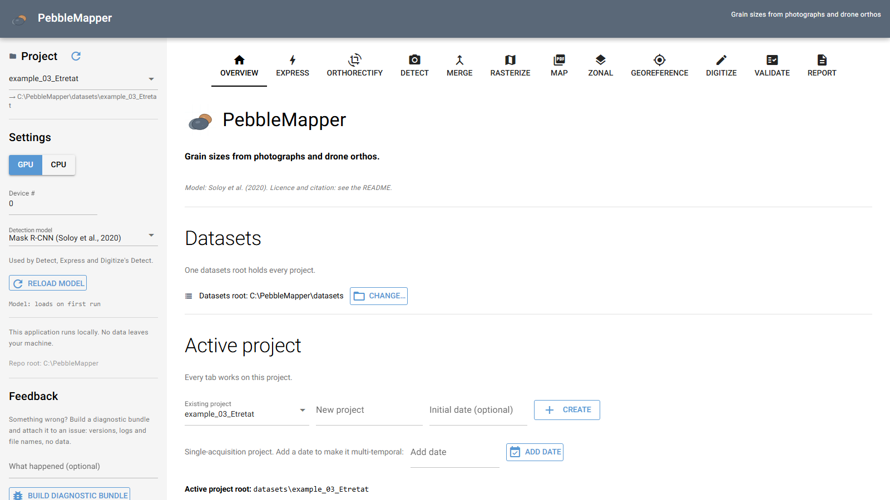

### 2.4 The left drawer

| Control | Meaning |
|---|---|
| **Project**, **Date** | The active project and, for multi-temporal projects, date. Every tab's default paths follow them. |
| **GPU** / **CPU**, **Device #** | The device the detector runs on. Use CPU without a CUDA-capable GPU or when the GPU runs out of memory. |
| **Detection model** | The model used by Detect, Express and Digitize. Mask R-CNN is built in; installed plug-ins also appear. See [Adding a detection model](developer/adding-a-detection-model.md). |
| **Reload model** | Drops the cached weights and frees GPU memory. Use it after replacing a weights file or after a model error. |
| **What happened (optional)**, **Build diagnostic bundle** | Writes a zip of versions, configuration, logs and file names (no imagery, no measurements) to `~/.pebblemapper/feedback/`, to attach to an issue. |
| **Stop PebbleMapper** | Shuts the server down. Queued jobs are saved and offered at the next start. |

### 2.5 Queues and the log console

Most tabs stage work in a queue. **Add to queue** saves the current form as a job; **Run all
queued** runs pending jobs in order; **Reset all** marks finished or failed jobs pending
again; **Clear queue** empties the queue without deleting files. Badges are grey (pending),
blue (running), green (done), orange (stopped) and red (error). The log console under the
action buttons records what each run did and where it wrote.

Queues are saved on disk. After a shutdown with jobs pending, the next start shows
*Interrupted queues from the previous session*. **Restore** brings the jobs back with their
parameters; a job that was running returns as interrupted, and finished rows are checked
against the files on disk. **Discard** archives them.

---

## 3. Worked examples

Example projects ship under `datasets/`, each with a `README.txt` describing its files.

| Project | Contents |
|---|---|
| `example_01_orthorectification` | A handheld quadrat photograph to rectify. |
| `example_02_quadrat_detection` | Rectified quadrat photographs, ready for Detect and Digitize. |
| `example_03_Etretat` | Étretat (Normandy), 10 June 2020: a 21 × 21 m crop of a UAV ortho and its DEM, four quadrat photographs (rectified; two also as shot), one placed in the ortho and digitised as ground truth, RTK positions, zones and a transect. |
| `example_04_gauge_scale` | A phone photograph with a boot in the frame, for Digitize's scale from an object. Photograph by Dr Mark Lorang. |
| `example_06_paper_validation` | The validation set of Soloy et al. (2020): 105 caliper-measured pebbles spread out in a 0.84 m frame on one photograph (IMG_0806), then the 27 largest in ten arrangements from spread out to heaped. Eleven rectified photographs, each with a Validate truth file and Mask R-CNN detections. |

### 3.1 A UAV ortho with Express

1. Select `example_03_Etretat`, or create a project and copy a georeferenced ortho into
   `input_data/images/`.
2. On **Express**, **UAV ortho-image** holds the newest ortho; the line under it gives its
   extent, GSD and detection windows.
3. Choose a preset (**Single window**, **Two-window combination** or **Three-window
   combination**) and check the detection model and GPU/CPU setting.
4. Click **Run**. *Pipeline stages* shows Detection, Merge, Rasterize, Map and Report.
5. When *Done.* appears, the CSVs, rasters, maps and `<project>_xprs_report.pdf` are in
   `output_results/`.
6. For a report that also includes later zonal and validation results, use the **Report**
   tab.

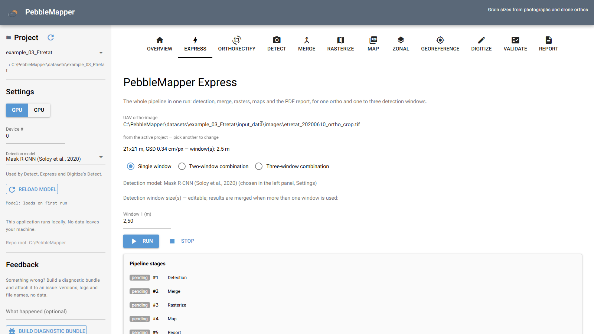

### 3.2 Quadrat photographs: Orthorectify, Detect, Digitize, Validate

1. Copy the raw quadrat photographs into `validation/raw/` (`example_03_Etretat` holds two).
2. **Orthorectify**: for each photograph, place the four frame corners, set **Quadrat size
   (m)**, and click **Rectify**, or record sizes for all and use **Rectify every ready
   file**. Rectified images go to `validation/orthorectified/`.
3. **Detect**: choose **Quadrat**. **Image directory** points at the rectified folder. Tick
   **Filter by confidence**, **Add to queue**, **Run all queued**. Each image gives
   `<origin>_individual_clasts.csv` in `output_results/vectors/`.
4. **Digitize**: outline every clast on a rectified image by hand, or start from the
   detector's proposals, and **Export CSV** to `validation/<stem>_truth.csv`. To place the
   photograph in an ortho, use Georeference first.
5. **Validate**: set **Truth CSV (manual measurements)** and **Detection CSV (model
   output)**, choose **Field to compare** (for example `Clast_length`), **Add to queue**,
   **Run all queued**. Results are saved under `validation/results/` for the report.

`example_06_paper_validation` is ready for step 5: each photograph has a truth file in
`validation/` and its detections in `output_results/vectors/`. On the four heaped
photographs (IMG_0791, 0792, 0795, 0796) only the pebbles fully visible from above are in
the truth, so precision there understates the model.

---

## 4. The tabs

### 4.1 Overview

The datasets root, the active project (**New project**, **Initial date (optional)**,
**Create**, **Add date**), the project folders, **Reorganise project files…**, and a list of
the tabs.

### 4.2 Express

The Ortho pipeline for one georeferenced ortho. Select the **UAV ortho-image**, a preset,
and the **Window N (m)** tile sizes (0.25–50 m, editable), then **Run**. **Stop** halts after
the current tile. A file without a geotransform is refused; use Detect in Quadrat mode.

| Preset | Windows | Tile overlap | Min confidence | Rasters | Maps |
|---|---|---|---|---|---|
| **Single window** | 2.5 m | 0 | 0.80 | Clast_length D50 (cell = window size, at least 1 m) | points |
| **Two-window combination** | 2.5, 5.0 m, merged | 0.20 | 0.70 | Clast_length D50, density, Folk–Ward sorting, 1 m cells; cells with < 3 clasts blanked | points, raster |
| **Three-window combination** | 1.0, 2.5, 5.0 m, merged | 0.25 | 0.60 | as above plus Clast_length D84 and Equivalent_diameter D50; < 5 clasts blanked | points, raster, density, on ESRI World Imagery |

The per-window CSVs use the standard Detect name (`<origin>_ws<size>m.csv`), so Detect can
resume from them. Everything derived from them carries `_xprs`. The Express report has no
zonal or validation section, and the lighter presets include fewer sections.

### 4.3 Orthorectify

Turns a photograph of a quadrat into a flat image of known GSD. Corners and sizes are saved
beside each photograph, so work can stop and resume.

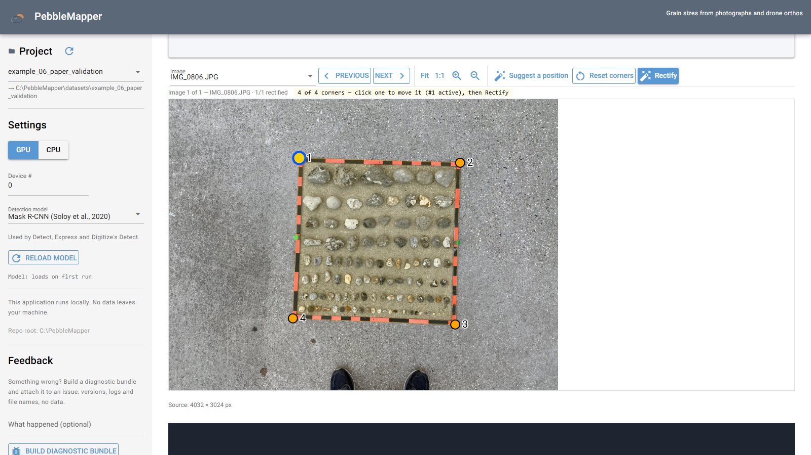

| Control | Meaning |
|---|---|
| **Folder of photographs** | JPEG, PNG, TIFF or HEIC/HEIF; filled with `validation/raw/`. The table lists *Corners*, *Size* and *Rectified output* per photograph. Click a row to work on it; × removes it from the list, not from disk. |
| **Work on one photograph from outside this folder** | A single photograph elsewhere; outputs go beside it. |
| **Quadrat size (m)** | Side length from corner 1 to corner 2. The last value is kept for the next photograph. |
| **I confirm this size (1.000 m)** | Shown while the size is the untouched default. |
| **Record for every photograph** | Writes the current size beside every photograph, making them ready for the folder run. A photograph with a different recorded size is left alone. |
| **Frame thickness (m) — optional** | Width of the frame bars, recorded with the output so that Detect and Georeference leave the frame out. Empty and 0.000 differ: 0.000 means the frame is not in the way. |
| **outer** / **inner** | The frame edge the corners are on. Use the same edge for all four. |
| **Segment lengths (non-square)** | Separate lengths for segment 2, or for segments 3 and 4, when the quadrat is not square. |
| **Lens distortion** | **Load calibration file…** (OpenCV `.json`/`.yml`/`.npz`) or type **fx fy cx cy** and **k1 k2 p1 p2 k3**; **Apply distortion correction** undistorts the photograph and corners. |
| **Output GSD (m/pixel)** | 0 = automatic (the finest source-pixel resolution). |
| **Output file (.png/.jpg)** | Default `orthorectified/<stem>_rectified.jpg` beside the source folder; `_GSD=<value>m` is added on save. |

**Work surface.** Click the four corners in order; a magnifier follows the cursor. **1:1**
shows one image pixel per screen pixel for precise placement. Hold **Space** and move the
mouse to pan. **Guide** draws the previous quadrat's outline as a dashed reference showing
corner #1 and the numbering direction. **Suggest a position** finds the frame from a
photograph already rectified in the folder, and stays silent unless two independent checks
agree. **Reset corners** clears them.

**Rectify** writes the image, a `.json` sidecar with the GSD and placement, and
`<stem>_corners.txt` / `<stem>_segments.txt` beside the source photograph. Rectifying at the
untouched default size gives a warning, because a wrong size scales every measurement.
**Rectify every ready file** processes every photograph with corners and a size, and writes
`rectification_run.txt`; **overwrite existing outputs** is off by default.

### 4.4 Detect

Per-clast measurements from a folder of images.

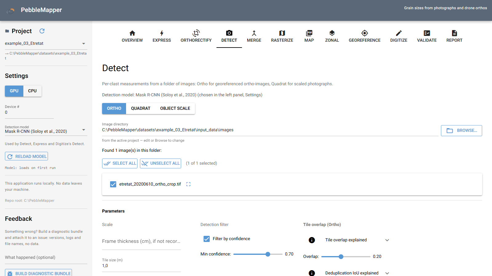

| Control | Mode | Meaning |
|---|---|---|
| **Ortho** / **Quadrat** / **Object scale** | | Ortho lists `.tif`/`.tiff`. Quadrat lists photographs (`.jpg`, `.png`, `.heic`, …) and uses each one's GSD (sidecar, then name, then **Resolution**). Object scale uses a scale object drawn on each photograph; photographs without one are left out of the queue. |
| **Image directory**, file list | | Tick the images to process. In the photograph modes each file shows the source of its scale. The crop icon opens the ROI canvas. |
| **Resolution (m/pixel)** | Quadrat | GSD for files that carry none. |
| **Tile size (m)** | Ortho | 0.5–20 m. Larger tiles are faster but miss small clasts; typically 1 m for pebbles, 2.5 m for cobbles. Run several sizes and combine them on Merge. |
| **Filter by confidence**, **Min confidence** | both | Drops detections scoring below the threshold. 0.7 is usual. |
| **Overlap** | Ortho | Fraction shared by adjacent tiles, 0–0.5, default 0.20. |
| **Dedup IoU** | Ortho | Duplicate threshold between overlapping tiles, default 0.30. |
| **Save plots**, **Save CSV** (Advanced) | both | Quadrat: `<stem>_overlay.png` and `<stem>_histogram.png`. Ortho: one PNG per tile in `figures/tiles/`. |
| **Default kstart for fresh jobs** (Advanced) | Ortho | First tile of a job without a checkpoint. |
| **Drop dark / bright tiles before detection** (Advanced) | Ortho | Skips tiles dominated by nodata (0–10), vignetting (15–40) or sky (240–255), using **Dark threshold**, **Bright threshold** and **Max bad-pixel fraction**. Off by default. |
| **Exclude the quadrat frame** | Quadrat, Object scale | On by default; see below. |
| **ROI per image (optional)** | both | Shapes drawn on an image, saved to `<image_stem>_roi.geojson` in `input_data/geometries/`. Ortho: tiles centred outside are skipped. Quadrat: clasts centred outside are dropped. |

**Tile overlap.** At overlap 0 a clast crossing a tile boundary is cut in two and, because
the model skips cropped objects, usually missed in both tiles. At 0.20–0.25 most boundary
clasts are whole in at least one tile. The tile count grows as 1/(1 − overlap)²: about 1.56×
at 0.20 and 1.78× at 0.25.

**Dedup IoU.** With overlap, one clast can appear in 2 to 4 tiles. Detections whose
intersection-over-union reaches the threshold are merged and the higher-scoring one is kept.
A higher value (0.50) keeps more clasts but leaves more duplicates; a lower value (0.15)
removes more duplicates but may merge touching clasts. 0 disables deduplication, for use with
overlap 0.

**Exclude the quadrat frame.** Orthorectify records the frame bar width in the image sidecar
(`PM_FRAME_THICKNESS_M`). That band, plus a 10 % margin (at least 2 px), is left out of the
measurements for every model. The file list shows the result, for example *frame 2.0 cm =
36 px + 4 px margin left out on each edge; 0.80 x 0.80 m measured*. A photograph without
the record uses **Frame thickness (cm), if not recorded**, or is measured whole. A photograph
with its own ROI keeps it.

**Scale from an object, per photograph.** In Object scale and Quadrat modes, a panel under
the ROI canvas scales a folder of photographs that have no GSD. Pick the **Scaling object**
and click its two ends; the segment is saved at once. **Next without a scale** opens the next
unscaled file; **Clear segments** removes the open photograph's segments. Segments are read
from `<stem>_truth.scale.json` and take precedence over the GSD and **Resolution**. An
object of known length gives metres per pixel. An object of unknown length gives sizes in
its own unit: the CSV gets a `unit` column and the plots are skipped. Digitize (section 4.10)
edits the object library and handles two objects on one photograph.

**Queue.** One job per ticked file. An Ortho row reads *Fresh run.*, *Will resume from tile
N (… clasts already saved)*, or *Final CSV already exists — this job is marked done and
skipped on Run*. Row controls: the resume tile; **→ validation** (write outputs under
`validation/<image stem>/`, for runs on truth quadrats); ↺ (delete checkpoint and CSV and
restart); reorder; delete. **Stop** finishes the current tile, saves the checkpoint and moves
on; **Stop all** halts the queue.

**Outputs.** Ortho: `<origin>_ws<size>m.csv` in `output_results/vectors/`, with a
`.run.csv` checkpoint during the run. Quadrat: `<origin>_individual_clasts.csv`, figures in
`output_results/figures/`. A model other than Mask R-CNN adds `_model=<id>` to the origin
(section 5.4). Each job logs to `output_results/logs/`. Without a project, outputs go beside
the image.

### 4.5 Merge

Combines detection runs of one ortho at several window sizes. The merge runs from the
largest window down; on conflicts the larger window's rows win.

| Control | Meaning |
|---|---|
| **CSV path**, **Window (m)** | At least two inputs. The window is read from `_ws<size>m` in the name, or typed. **From project…** fills the rows from the project, grouped by image. |
| **Output CSV path** | Default `<stem>_merged.csv` beside the largest-window CSV. |
| **Method** | `iou` (ellipse polygons, precise) or `centroid` (distance scaled by size, fast). |
| **Overlap threshold** | Above it two clasts are duplicates. 0.30 for IoU. |
| **Polygon vertices (IoU)** | 8–128; 32 by default. |

### 4.6 Rasterize

Grain-size rasters from a clast CSV. Choose fields and statistics, add them to the queue, run
the queue.

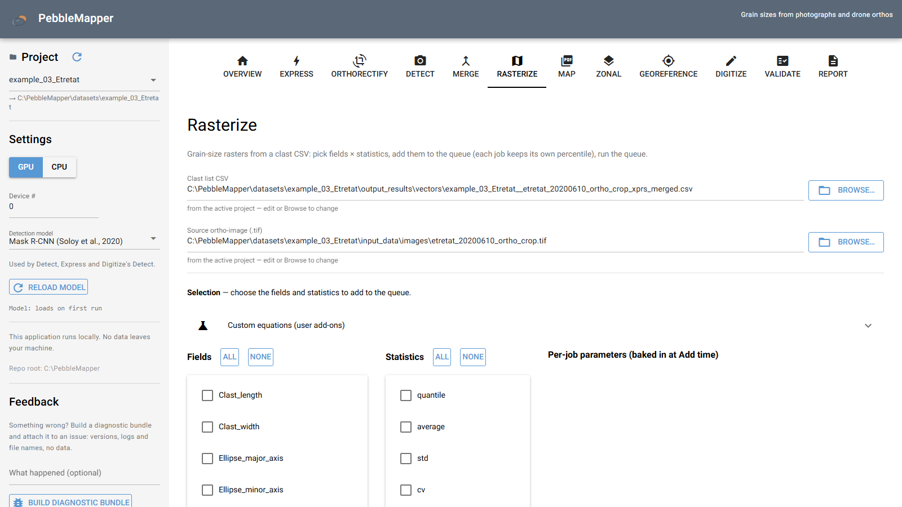

**Inputs.** **Clast list CSV** (the newest merged CSV, else detection CSV) and **Source
ortho-image (.tif)**, which sets the raster extent and CRS.

**Fields.** The size and shape columns of the clast table; `Clast_elongation`
(width/length) and `Clast_circularity` (equivalent diameter/length); sediment-transport
thresholds from `Equivalent_diameter` (Van Rijn, Soulsby, Shields, Hjulström, Le Roux,
settling velocity, critical shear stress and velocity, Corey shape factor, grain roughness
k_s); and custom equations ([Custom equations](#custom-equations)). Hover a field for
its definition.

| Statistic | Meaning |
|---|---|
| `quantile` | The percentile in **Percentile (for 'quantile')**: 0.5 → D50, 0.84 → D84. |
| `average`, `std`, `cv`, `skewness`, `kurtosis`, `mode` | Moment statistics. For sizes prefer the median and Folk–Ward. On `Orientation` only `average` is accepted. |
| `d_percentiles` | Five bands: D5, D16, D50, D84, D95. |
| `distribution` | 99 bands: q01…q99. |
| `folk_ward_sorting`, `folk_ward_skewness`, `folk_ward_kurtosis` | Folk & Ward (1957) on the φ scale, φ = −log₂(D/1 mm). Size fields only. |
| `sorting` | Folk–Ward σ on raw values, for older projects. |
| `density` | Clasts per cell area, independent of the field. |
| `packing_index` | Sum of clast area / cell area, 0–1; a relative index, since the detector under-represents cover. One band per size bin when bins are set. |
| `packing_clustering` | Pielou evenness of the size-bin packing fractions, 0 to 1. Needs bins. |

Incoherent combinations are skipped at **Add to queue** and named. *About the selected
statistic(s)* gives equations and references.

**Per-job parameters.** **Percentile (for 'quantile')**; **Wave period T (s)** (Le Roux);
**Water density (kg/m³)** (1025 seawater, 1000 fresh); **Size bins** (**Fixed (mm)** or
**Percentile of CSV**, **Bin edges (comma-separated)** such as `16, 64, 256`, **Bin field**).

**Output.** **Cell size (in ortho units)**; **Min cell density (clasts/cell)** (cells with
fewer clasts become NaN); **Output directory** (default `output_results/rasters/`).

### 4.7 Map

A figure of georeferenced data in a projected CRS, to PNG, PDF or SVG. Quadrat results are
viewed through Detect's overlay PNGs.

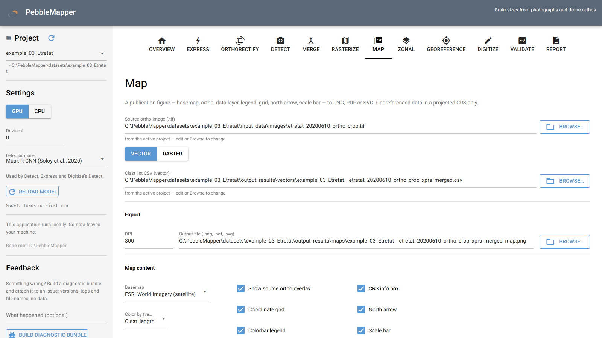

| Control | Meaning |
|---|---|
| **Source ortho-image (.tif)** | The ortho drawn under the data. |
| **vector** / **raster** | Points coloured by a field of a clast CSV (**Color by (vector mode)**), or a raster (first band of a multi-band raster). |
| **DPI**, **Output file (.png, .pdf, .svg)** | Default `<stem>_map.png` in `output_results/maps/`. |
| **Basemap** | ESRI, Stadia, USGS, OpenStreetMap, OpenTopoMap or CartoDB layers, or `(none)`. Tiles are downloaded at rendering. |
| **quantile** / **linear**, **vmin**, **vmax** | Quantile spreads the colours evenly over the data; linear uses the 5th–95th percentiles unless limits are set. `Orientation` uses a cyclic ramp. |
| **Unit system**, **Size unit (override)** | Units of labels and scale bar only. |

The remaining controls set colormap, point size, transparency, grid, legend, north arrow,
scale bar, border and title. **Preview** renders without writing; **Save preview** saves it.
**Add all rasters** queues one map per raster of the selected ortho. A warning appears when
the ortho and the data do not overlap (wrong file or CRS mismatch).

### 4.8 Zonal

Three sub-tabs: **Polygons**, **Transects** and **Profile figure**.

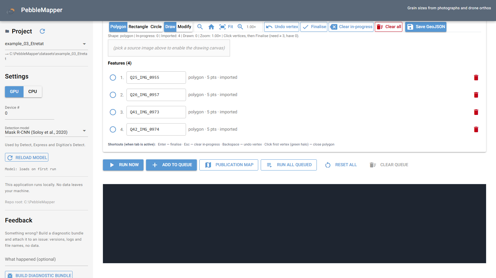

**Zones canvas.** Load a **Source image** (an ortho) and optionally a **Vector layer (loaded
into canvas)**. Type a **Zone set name**, then draw polygons, rectangles, circles or
transects. Each shape is saved at once to `input_data/geometries/<name>.geojson`; without a
name nothing is written. A zone set can be reused on any ortho or date. Edit a feature's name
in its row; it labels the results.

| Control | Mode | Meaning |
|---|---|---|
| **Detection CSV** | Polygons | The clast CSV summarised per polygon. |
| **Percentiles (comma-separated)** | Polygons | Default `5, 16, 25, 50, 75, 84, 95` (D for size fields, P otherwise). Count, density, mean, std, median, IQR, CV, range, skew, kurtosis and Folk–Ward measures are always included. |
| **Raster (.tif)**, **Sampling step (m)**, **bilinear** / **nearest**, **Band** | Transects | The raster sampled along each line. |
| **Field name** | both | The CSV column, or what the raster represents. |
| **ID field (label for each zone)** | both | `name` by default, or the feature index. |
| **DEM (optional, .tif)** | both | Adds elevation statistics, or an elevation profile. |
| **Output CSV** | both | Blank = automatic name in `output_results/zonal/`, with scatter and violin plots. |

**Run now** runs the form; **Publication map** draws the raster with the zones. *The zones
and the clasts do not overlap* means the zone set was drawn on another image. *The transects
returned no samples* means the lines fall outside the raster or on nodata.

**Profile figure.** Grain size above and elevation below on one distance axis, one line per
date, with summary, change and binned tables. **Add CSV** adds one transect CSV per date; a
blank **Label (optional)** uses the date folder, so an undated project needs a label. Set
**Table bin width (m)** and a **Caption (what the reader should conclude)**, then **Render
profile figure + tables**. Output in `output_results/zonal/`.

### 4.9 Georeference

Places a rectified quadrat photograph in an ortho. Do this before digitising: the match uses
the photograph alone, and a quadrat that cannot be located may not be worth outlining.

**What to expect.** About half of quadrats are placed when the ortho's resolution is within a
few times the photograph's, and far fewer when the gap is larger. A refusal means the
evidence was insufficient, and nothing is written. Accepted matches have been accurate to a
few millimetres against surveyed corners.

| Control | Meaning |
|---|---|
| **Ortho-image to place quadrats in** | The georeferenced ortho. |
| **Folder of quadrat photographs**, **Quadrat to locate** | The rectified photographs. |
| **Quadrat resolution (m/pixel)** | Read from `_GSD=…m` in the name when present. |
| **Search radius (m)** | Distance from the seed to search. A larger radius costs time, not accuracy. |
| **Frame thickness (m)** | Cropped before matching; filled from the rectification record. |
| **Seed CRS** | CRS of typed coordinates and the seed list; `EPSG:4326` for handheld GPS. |
| **Seed list (CSV)** | Approximate positions: `photo,lat,lon` is enough. Column names are read flexibly (`image`/`filename`, `easting`/`northing`, `x`/`y`); an optional `crs` column overrides the Seed CRS. Check it with **Preview**. |

**Check all quadrats** reports every photograph (placed, refused, ambiguous) without
writing; **Save all located** writes the placements. Click a row to open its placement in
the editor. A row with candidates offers placements whose scores were too close to choose
between. **Also search the whole ortho for quadrats with no seed** takes about an hour per
unseeded quadrat (about 3,000 tiles on a 99 × 93 m survey, against about 80 for a seeded
one); quadrats searched together share the tiles read.

**Locate one quadrat.** Type a seed, or use the seed list or a pin, and click **Check for a
match**. The verdict reads *MATCH ACCEPTED* or *NO MATCH*. The editor shows the photograph on
the ortho (high-pass filtered by default) with opacity, **Blink**, **Zoom**, position,
rotation and one-pixel nudges. A correct placement scores about 0.40. **Keep**, **Discard**,
**Reset**; **Save georeferenced outputs** after an accepted match.

**Pin quadrats on the ortho.** Choose **Photo this pin is for** and click roughly where it
was. A pin is a starting point; it overrides the seed list.

Outputs in `validation/georectified/`: `<stem>.tif` (georeferenced), `<stem>.georef.json`
(the placement record) and, when a detection CSV exists, `<stem>_individual_clasts.csv` in
world coordinates. An existing placement is not overwritten by a single save.

### 4.10 Digitize

Outline clasts by hand and export a CSV in the detection schema for Validate. The detector
can supply editable proposals. A photograph with no GSD can be scaled from an object in it.

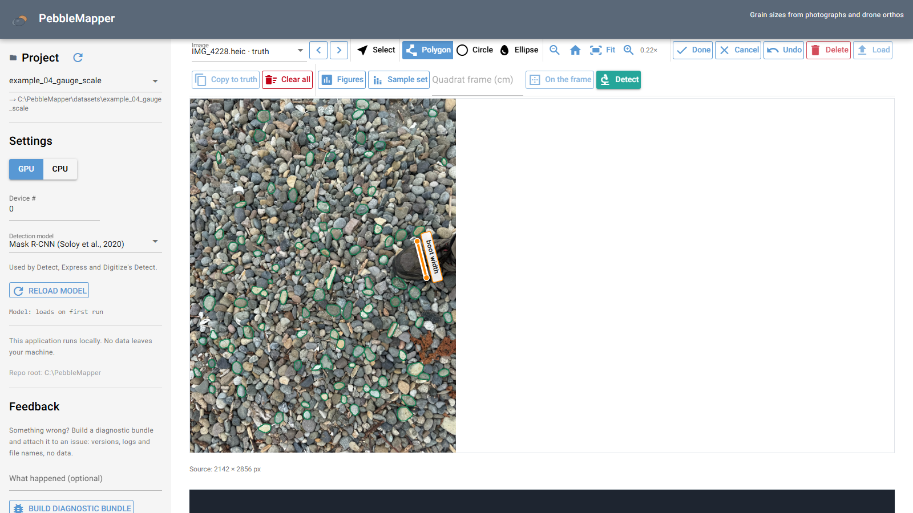

**Label sets.** Each photograph has a truth set (`<stem>_truth.csv`, what Validate uses) and
one set per detection model (`<stem>_labels=<model>.csv`, or the Detect tab's output). The
**Image** list has one entry per photograph and set, for example *IMG_0955.jpg · truth* and
*IMG_0955.jpg · Segmenteverygrain*. **Copy to truth** adds a model set's clasts to the
truth or replaces the truth with them.

| Control | Meaning |
|---|---|
| **Resolution (m/pixel)** | The photograph's GSD, read from its sidecar or name. Required for export. |
| **Place it in the ortho** | Opens Georeference with this photograph. |
| **Select** | Click a clast to select it; **Shift** or **Ctrl** + click toggles; drag a box to select the clasts centred inside. A single selected clast shows handles to reshape it. |
| **Polygon** / **Circle** / **Ellipse** | Polygon: click each vertex; double-click, Enter or a click on the first vertex closes it. Circle: centre, then rim. Ellipse: both ends of the major axis, then the minor axis. |
| **Undo**, **Delete**, **Load**, **Clear all** | Undo the last addition or deletion; delete the selected clasts (also the **Delete** key); reload the set's saved clasts; clear the canvas without touching files. |
| **Autosave after each commit** | Saves after every clast. It never overwrites a saved CSV whose clasts are not loaded. |
| **Detect**, **Detect score threshold** | Runs the detector on the photograph. Each mask becomes an editable polygon in the model's set. Detections touching a scale segment or centred on the frame band are left out. |
| **Detection scale** | Auto, 1, 1/2, 1/3 or 1/4: resample before detection; measurements stay in original pixels. Auto is 1/2 for Mask R-CNN (almost no clasts lost, several times faster) and 1 for plug-ins, which lose small clasts at 1/2. |
| **Quadrat frame (cm)**, **On the frame** | Frame bar width, filled from Orthorectify and saved in the sidecar. **On the frame** selects clasts centred on the band. |
| **Digitized clasts** | Sortable table: **ID**, **Origin** (*hand* or model, *(edited)*), sizes, **Orientation**, **Score**. Clicking a row selects the clast. **Label of the selected clast** adds a note (`Label` column). |
| **Export CSV** | Writes `validation/<stem>_truth.csv` (metres) with `.contours.json`, `.provenance.json` and, with scale segments, `.scale.json`. |
| **Figures** | Overlay and distribution figures and `<origin>_gauge.csv` from the clasts on the canvas, in `output_results/gauge/`. |
| **Sample set** | Pools the clasts of every photograph in the folder into one distribution. |

**No GSD? Scale from an object.** Mark an object on the photograph with **Draw scale
segment** (click both ends). The objects are kept in the project library,
`<project root>/scaling_objects.json`, each with a **Name**, a **Known length** and a
**Unit**; length and unit may be left empty. Segments are saved per photograph in
`<stem>_truth.scale.json`. Once a segment exists, the object scale replaces the GSD.

- **Metric mode**, when every object used has a known length: the scale is the mean over the
  segments and results are in mm, cm, m, in or ft.
- **Custom mode**, when an object has no known length: results are in that object's unit
  (*0.7 boot width*). With two such objects, only the one chosen in **Result unit** sets the
  scale; the other's segments are drawn grey. The truth CSV gets a `unit` column; compare it
  only with a CSV in the same unit.

**Accuracy of an object scale.** A handheld photograph is a perspective view and nothing is
corrected. With the camera within about 10° of vertical and the object near the middle,
lengths are typically within ±8 %; at 20–30° of tilt, up to ±25 %, and areas up to twice
that. Two segments on the same object measure the tilt: the status line reports *segments
disagree by Y %*, in orange above 5 %. For published measurements, rectify the photograph.

**Figures** shows a card with the models and counts per origin, the overlay figure (outlines
coloured by length, axes, scale segments, n, D50 and D84), the distribution figure
(histogram and cumulative curve with D16, D50, D84) and, for an object scale, a disclaimer.
**Sample set** pools compatible tables (metric with metric, one object's unit with the same
unit) and lists skipped photographs; it writes `<origin>_sampleset.csv`, a per-photograph
summary and a distribution figure.

### 4.11 Validate

Compares a detection CSV with a hand-measured truth CSV. Both need `x`, `y` and the target
field, in the same CRS and unit.

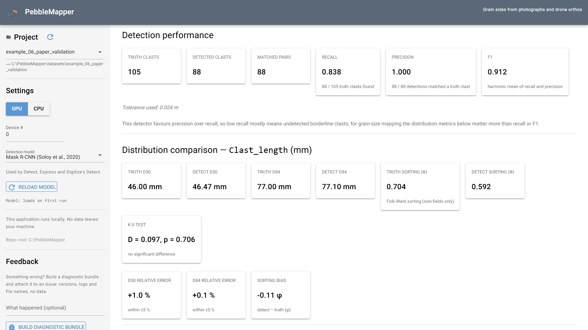

| Control | Meaning |
|---|---|
| **Truth CSV folder (optional)**, **Previous**, **Next** | Steps through a folder of truth CSVs, filling **Truth CSV** each time. |
| **Truth CSV (manual measurements)**, **Detection CSV (model output)** | The pair. |
| **Ground-truth source image (…)**, **UAV ortho image (…)** | Images for the overlay. |
| **Field to compare** | A column in both CSVs. **Add all common fields** queues one comparison per shared column. |
| **Truth GSD**, **Detection GSD** | For CSVs in pixel coordinates; see *Coordinate frame*. |
| **Quadrat footprint (restrict comparison to this area)** | **Truth is a georeferenced GeoTIFF**, **Centroid + dimensions**, or **One point + its corner + dimensions**. |
| **Spatial tolerance (m, 0=auto)** | Maximum pairing distance; 0 = half the median nearest-neighbour distance among truth clasts. |
| **Reject size mismatches > 50%** | Refuses pairs whose sizes differ by more than half. |
| **Statistical-only (skip spatial pairing)** | Compares distributions only, for different images of the same area. |
| **Apply detection threshold (recommended)**, **k (pixels)** | Truncates both sides at D_min = k × GSD; k = 8 by default. |

**Coordinate frame.** When the CSVs use pixel coordinates at different GSDs, set each side's
GSD; both are converted to metres before pairing. For a georeferenced GeoTIFF the GSD is
read from the file and these inputs are hidden.

**One point + its corner + dimensions.** The point is moved to the inferred centroid, and
pairs are sought within a circle of radius half the diagonal, which absorbs pointing error
and quadrat rotation.

**Rationale for the detection threshold.** The detector cannot reliably segment clasts
shorter than k × GSD on the long axis (4 cm at 5 mm/pixel, k = 8; Soloy et al., 2020). A
truth set at finer GSD contains a fine tail that the detection cannot resolve. Comparing the
full distributions would report a mismatch caused by the measurement process, so both sides
are truncated at D_min. Change k for another camera set-up.

**Batch truth from folder…** compares every CSV of a folder with one Detection CSV.

**Results.** Per comparison: detection performance (true positives, that is detections
paired with a truth clast; recall, true positives over truth clasts; precision, true
positives over detections; F1); distribution comparison (D50/D84 ratios,
Kolmogorov–Smirnov, Folk–Ward sorting, RMSE, Bland–Altman); diagnostic plots;
detection-limit diagnostics; the spatial pattern of matches and misses; an image overlay.
Mask R-CNN, the built-in model, favours precision over recall, so with it a low recall
mostly reflects missed borderline clasts. For grain-size mapping the distribution metrics matter more than
recall or F1. Results are saved as `.validation.json` in `validation/results/` and read by
the report.

### 4.12 Report

One PDF built from every file in the active project.

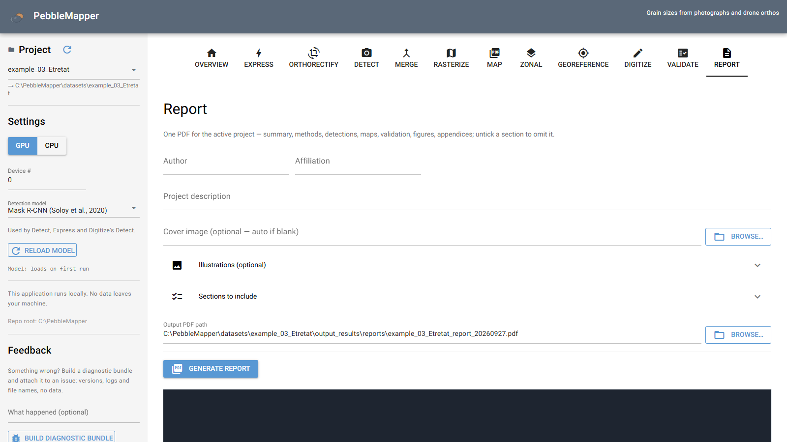

| Control | Meaning |
|---|---|
| **Author**, **Affiliation**, **Project description** | Cover text, saved in `<project>/.report_metadata.json`. |
| **Cover image (optional — auto if blank)** | When blank, a map of the project footprint. |
| **Illustrations (optional)** | Your own images with **Title** and **Description / caption**. |
| **Sections to include** | Optional sections: cover and summary, contents, spatial statistics, zonal statistics, validation, and appendices A (run register), B (data dictionary) and C (glossary). Data and processing, detection results, interpretation and references are always included. |
| **Output PDF path** | Default `output_results/reports/<project>_report_<YYYYMMDD>.pdf`. |

**Generate report** builds the PDF and shows a preview. A section whose input is malformed is
skipped with a note.

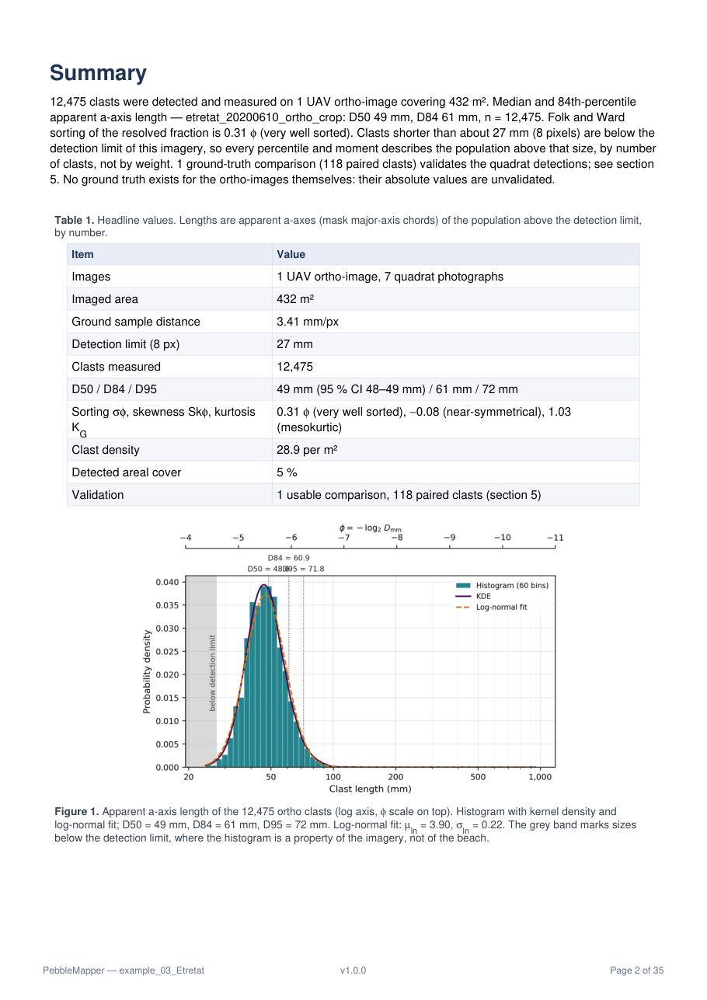

---

## 5. Understanding the outputs

### 5.1 Units

Sizes are stored in metres (areas in m²) and displayed in millimetres (mm²). `Clast_length`
and `Clast_width` are the apparent a- and b-axes in plan view; `Ellipse_major_axis` and
`Ellipse_minor_axis` belong to the fitted ellipse and are not interchangeable with them.
`Score` is not comparable between models. See [The clast table](#the-clast-table).

### 5.2 Raster statistics

A raster cell holds one statistic of the clasts whose centroids fall in it. A `quantile` at
*p* is labelled D*p*: 0.5 → D50 (median), 0.84 → D84. The Folk–Ward statistics use
φ = −log₂(D / 1 mm). Cells with fewer clasts than **Min cell density** are NaN.

### 5.3 The detection limit

The detector cannot reliably segment clasts shorter than about 8 pixels:
D_min = 8 × GSD, which is 4 cm on a 5 mm/pixel ortho (Soloy et al., 2020). An ortho
grain-size distribution is therefore truncated at D_min. Validate's **Apply detection
threshold (recommended)** accounts for this.

### 5.4 How outputs are named

| Output | Name |
|---|---|
| Detection at one window | `<origin>_ws<size>m.csv` (`.run.csv` while running, `.partial.csv` if stopped over a complete run) |
| Quadrat detection | `<origin>_individual_clasts.csv` |
| Merge | `<stem>_merged.csv` (`<origin>_xprs_merged.csv` from Express) |
| Raster | `<csv stem>_<field>_<statistic>_cellsize=<c>m[_bins=<edges>][_mind=<n>].tif` |
| Map | `<raster or csv stem>_map.png` |
| Zonal | `<csv stem>_zones=<set>_field=<field>_id=<ID field>.polygons.csv`, `<raster stem>_zones=<set>.transects.csv` |
| Digitize | `validation/<stem>_truth.csv`; `output_results/gauge/<origin>_gauge.csv`, `<origin>_sampleset.csv` |

`<origin>` is `<project>[_<YYYYMMDD>]__<image stem>`. Later outputs inherit the stem of
their input, so a file stays traceable to its image. A quantile writes `D<percentile>` as
the statistic (`…_Clast_length_D50_cellsize=1.0m.tif`). A detection by any model other than
Mask R-CNN carries the model in its origin, `<origin>_model=<id>` (for example
`IMG_0806_model=seg_individual_clasts.csv`), so a second model on the same photograph adds a
file instead of replacing the first.

---

## 6. Troubleshooting

**A file dialog blocks the page.** Pickers open a dialog from the application's process;
the page waits until it is closed.

**Model weights missing.** Detect and Express refuse to start with *Detection model '…' is not
available (weights / environment missing)*. Put `mask_rcnn_clasts.h5` in `model_weights/`
and click **Reload model**.

**GPU not found or out of memory.** Switch to **CPU**, or click **Reload model** to release
GPU memory.

**A run stops.** An Ortho job keeps its `.run.csv` checkpoint and resumes from the next tile.
Click ↺ on the row for a clean restart. The page can be reloaded during a run; the run
continues on the server.

**No clasts, or an empty CSV.** Ortho: check the tile size, the confidence threshold, the
brightness filter and the ROI file. Quadrat: check the GSD. Zonal: *No clasts fell inside any
of the zones* usually means the zone set was drawn on another image.

**Long Windows paths.** Output names can exceed the 260-character Windows limit, which other
tools may not handle. Keep the datasets root short (for example `D:\pm\datasets`).

**An iPhone photograph (`.heic`) does not open.** Run `pip install pillow-heif` in the
`maskrcnn` environment and restart.

**A photograph appears sideways.** Orthorectify, Digitize and Zonal show photographs as their
pixels are stored, ignoring EXIF rotation. Rotate such a JPEG in an image editor first.

**Logs.** Each detection job writes a log in `output_results/logs/` and
`<csv stem>_detection_log.txt` beside the CSV. Crash traces (`crash_*.log`) go to the same
folder, or to `~/.pebblemapper/logs/` without a project. To report a problem, build a
diagnostic bundle in the left drawer and attach it to an issue.

---

## The clast table

Every detection model produces this table, and every later stage reads it. Values are stored
in the stored unit and shown in the display unit, converted by the factor.

| # | column | display label | display unit | stored unit | ×factor |
|---|---|---|---|---|---|
| 1 | `clast_ID` | clast_ID | (dimensionless) | — | 1.0 |
| 2 | `x` | x | m | — | 1.0 |
| 3 | `y` | y | m | — | 1.0 |
| 4 | `Clast_length` | Clast_length | mm | m | 1000.0 |
| 5 | `Clast_width` | Clast_width | mm | m | 1000.0 |
| 6 | `Ellipse_major_axis` | Ellipse_major_axis | mm | m | 1000.0 |
| 7 | `Ellipse_minor_axis` | Ellipse_minor_axis | mm | m | 1000.0 |
| 8 | `Surface_area` | Surface_area | mm² | m² | 1000000.0 |
| 9 | `Perimeter` | Perimeter | mm | m | 1000.0 |
| 10 | `Equivalent_diameter` | Equivalent_diameter | mm | m | 1000.0 |
| 11 | `Eccentricity` | Eccentricity | (dimensionless) | — | 1.0 |
| 12 | `Solidity` | Solidity | (dimensionless) | — | 1.0 |
| 13 | `Mean_intensity` | Mean_intensity | (dimensionless) | — | 1.0 |
| 14 | `Score` | Score | (dimensionless) | — | 1.0 |
| 15 | `Orientation` | Orientation | ° | — | 1.0 |

| column | meaning |
|---|---|
| `clast_ID` | Row identifier. Not stable across runs. |
| `x`, `y` | Centroid: world coordinates in the ortho's CRS; image pixels for a photograph, `y` counted upward from the bottom edge. |
| `Clast_length`, `Clast_width` | Chords of the mask through its centroid along the fitted ellipse's axes: apparent a- and b-axes. |
| `Ellipse_major_axis`, `Ellipse_minor_axis` | Axes of the best-fit (second-moment) ellipse. |
| `Surface_area`, `Perimeter` | Area and boundary length of the mask. |
| `Equivalent_diameter` | Diameter of the circle of equal area. |
| `Eccentricity` | Ellipse eccentricity, 0 (circle) to 1 (line). |
| `Solidity` | Mask area / convex-hull area; `nan` when the hull cannot be computed. |
| `Mean_intensity` | Mean image intensity under the mask. |
| `Score` | Detector confidence, 0 to 1, specific to each model. |
| `Orientation` | Bearing of the long axis, clockwise from image-up, on [0, 180): 0° vertical, 90° horizontal, 45° lower-left to upper-right. Image-up is grid north for an ortho. It is not an anticlockwise angle from east. |

Column order is part of the format. The truth CSV of Digitize and the Digitize figures'
`_gauge.csv` may add `unit` and `Label` columns.

**Sidecars.** Beside a clast CSV, `<csv stem>.contours.json` holds each clast's outline
(image pixels or world coordinates), which Digitize's **Load** and the figures use.
`<csv stem>.provenance.json`, written with Digitize tables, records for each `clast_ID`
whether it was drawn by hand or proposed by a model (and whether it was edited), with the
model name, version, licence, weights, detection scale and confidence threshold of each run.
No stage reads a sidecar to compute a number.

---

## Project folders

A project folder holds 21 kinds of paths. New projects use the canonical path. Projects in
the older layout (`results/` instead of `output_results/`) keep working: the legacy path is
used when it exists. For dated projects, a `<date>/` level sits between the project folder
and these paths. The table follows `_KIND_SUBPATHS`, `_LEGACY_KIND_SUBPATHS` and
`_INPUT_KIND_CANDIDATES` in `functions/layout.py`.

The 21 kinds:

| kind | canonical | legacy | contents |
|---|---|---|---|
| `images` | `input_data/images` | `images` | Imagery; also found in `input_data` or `images`. |
| `dem` | `input_data/dem` | `input_data/dem` | Elevation rasters; also found in `dem`. |
| `geometries` | `input_data/geometries` | `input_data/geometries` | ROI and zone-set GeoJSON. |
| `vectors` | `output_results/vectors` | `results/vectors` | Clast CSVs. |
| `checkpoints` | `output_results/vectors/checkpoints` | `results/vectors/checkpoints` | Run checkpoints. |
| `rasters` | `output_results/rasters` | `results/rasters` | Rasters. |
| `figures` | `output_results/figures` | `results/figures` | Detection figures. |
| `maps` | `output_results/maps` | `results/maps` | Maps. |
| `zonal` | `output_results/zonal` | `results/zonal` | Zonal outputs. |
| `gauge` | `output_results/gauge` | `results/gauge` | Digitize figures and sample sets. |
| `reports` | `output_results/reports` | `results/reports` | PDF reports. |
| `logs` | `output_results/logs` | `results/logs` | Logs, crash traces. |
| `detections` | `output_results/vectors` | `results/vectors` | Same as `vectors`. |
| `validation` | `validation` | `validation` | Truth CSVs. |
| `validation_images` | `validation/images` | `validation/images` | Validation images. |
| `validation_results` | `validation/results` | `validation/results` | Validate results. |
| `validation_raw` | `validation/raw` | `validation/raw` | Raw quadrat photographs. |
| `validation_rectified` | `validation/orthorectified` | `validation/orthorectified` | Orthorectify output. |
| `validation_georectified` | `validation/georectified` | `validation/georectified` | Georeference output. |
| `validation_gps` | `validation/gps` | `validation/gps` | GPS positions. |
| `validation_reports` | `validation/results` | `validation/results` | Same as `validation_results`. |

The scaling-object library is `scaling_objects.json` at the project root.

---

## Custom equations

A custom equation (add-on) is a per-clast formula computed from the columns of the clast
table. It can be rasterized, mapped, summarised per zone and reported like a built-in field.
The clast CSV is never modified; values are computed when needed.

An add-on is a JSON object; a file holds a list of them:

| Key | Required | Meaning |
|---|---|---|
| `name` | yes | Field name: letters, digits and underscores. |
| `inputs` | yes | The columns the expression reads, including add-ons defined earlier in the file. |
| `expression` | yes | The formula, evaluated per clast with the inputs as variables. |
| `units` | no | Unit label, for example `"m/s"`, `"N/m^2"`, `"mm"`, or `"dimensionless"`. |
| `factor` | no | Display multiplier, default `1.0`; the stored value is unchanged. |
| `description` | no | Tooltip text. |

```json
[
  {
    "name": "Submerged_weight",
    "inputs": ["Equivalent_diameter"],
    "expression": "1650 * 9.81 * (3.14159 / 6) * pow(Equivalent_diameter, 3)",
    "units": "N",
    "description": "Submerged weight of an equivalent sphere, quartz in seawater"
  }
]
```

**Units.** Inputs are in stored SI units: lengths in metres, areas in m², `Orientation` in
degrees; the other columns are dimensionless. To display a length in millimetres, set
`"units": "mm"` and `"factor": 1000`.

**Files.** Read in this order; a later file overrides an add-on of the same `name`:

1. `hydraulic_addons.json` at the repository root: the shipped add-ons (settling velocity,
   dimensionless grain size, critical shear stress and velocity, Corey shape factor, grain
   roughness).
2. `<project>/addons.json`: add-ons for one project.
3. `<repository>/user_addons.json`: add-ons for every project.

After editing a file, reload the page.

**In the application.** On **Rasterize**, open **Custom equations (user add-ons)**. *Create a
new custom field* has **Field name**, **Units**, **Input columns (comma-separated)**,
**Expression**, **Description (optional)** and **Display scale factor**. **Validate** checks
the expression; **Add to project addons.json** saves it; **Export JSON…** writes it to a file.

**Allowed expressions.** Numbers, input names, parentheses; `+ - * / // % **`; comparisons,
`and`, `or`, `not`, `a if condition else b`; and the functions `sqrt`, `log`, `log2`,
`log10`, `exp`, `sin`, `cos`, `tan`, `asin`, `acos`, `atan`, `atan2`, `sinh`, `cosh`, `tanh`,
`floor`, `ceil`, `fabs`, `abs`, `min`, `max`, `round`, `pow` (angles in radians, exponent at
most 64). Attribute access, indexing, strings, assignments and imports are refused. Write
constants as numbers. A clast whose expression fails gets `NaN`; an add-on whose input column
is missing is skipped with a warning.
